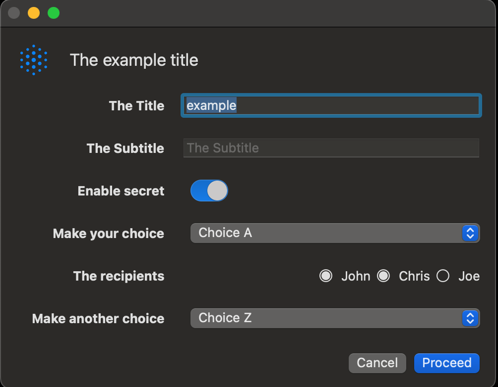
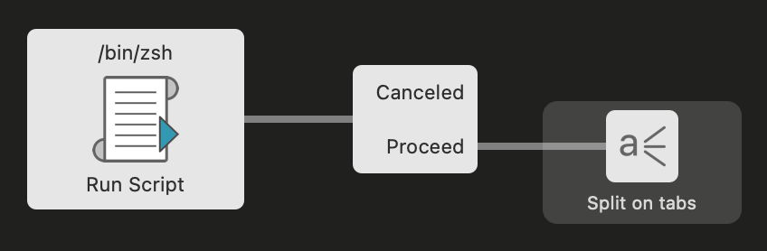
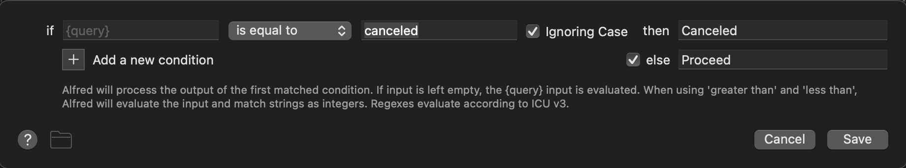

# Alfred Form Generator

The application `afg` is used to generate `Swift` code 
from a specification. The generated `Swift` 
code is a standalone application that presents the user with a form 
to provide answers that can then be parsed by `Alfred` and take
appropriate actions.

The application prints the entered values to `STDOUT` as tab separated
key value pairs.

## Usage

```bash
Alfred Form Generator

Usage: afg [OPTIONS] --field <field> <title>

Arguments:
  <title>  Specify the dialog title

Options:
      --separator <field_separator>  Specify the field separator [default: @]
      --field-height <INT>           Specify the field height [default: 35]
      --window-width <INT>           Specify the width of the window [default: 400]
  -f, --field <field>                Describes details of a field. Can be repeated multiple times.
  -h, --help                         Print help
  -V, --version                      Print version

This application is used to generate a swift application that can be run in Alfred as a form input
```

## Specification

The specification should at least specify the `title` and at least one form `field`.

The `title` is a free format title that should specify the goal of the form.

The `field's` specify the user interface components, from top to bottom in the order
as specified on the command line.

### Field

The form `field` option has 4 or 5 fields depending on the type
of field.

|Element| Description                                                                                                                                                                      |
|-|----------------------------------------------------------------------------------------------------------------------------------------------------------------------------------|
|type| The type of form field. Possible values are "string", "bool" "radio" and "picker". This part is case insensitive.                                                                |
|name| The name of the form field. The name is used to return the value.                                                                                                                |
|default| The default value. This value can be empty, but should still be specified without a value. In the case of a radio button this field can contain multiple comma separated values. |
|decoration| The annotation (description) of the field in the form.                                                                                                                           |
|choices| The possible values of the picker or radio button.                                                                                                                               |

An example of the field specification is as follows:

```bash
--field type=String@name=title@default=example@decoration="The Title"
```

The keys are case insensitive. The default separator is `@` and can be
overruled with the option `--separator`.

## An example

A full example could be as follows:

```bash
afg \
	--field type=String@name=title@default=example@decoration="The Title" \
	--field type=String@name=subtitle@default=@decoration="The Subtitle" \
	--field type=Bool@name=enabled@default=true@decoration="Enable secret" \
	--field type=Picker@name=choice@default=0@decoration="Make your choice"@choices="Choice A,Choice B,Choice C" \
	--field type=Radio@name=radio@default=1,John@decoration="The recipients"@choices="John,Chris,Joe" \
	--field type=Picker@name=choice2@default=2@decoration="Make another choice"@choices="Choice X,Choice Y,Choice Z" \
	--window-width 500 \
	"The example title"	
```

The window looks as follows:



An example output of the above command is:

```bash
title=example	subtitle=my subtitle	enabled=true	choice=Choice A	radio=Chris,John	choice2=Choice Z```
```

Note that the output line has no newline and each field is tab separated.

when the dialog is cancelled, the output is the word "canceled".

## Install

To install `afg` take the following steps:

1. You must install `Swift` on your system. See [https://www.swift.org/install/macos/](https://www.swift.org/install/macos/).
Swift is used to generate the form that presents your questions.
2. You now have the option to either install a pre-compiled binary or
compile the binary yourself:
   
   ### Install a pre-compiled binary
   The latest binary can be found here: [https://github.com/fappelman/afg/releases/download/v0.9.2/afg.dmg](https://github.com/fappelman/afg/releases/download/v0.9.2/afg.dmg)
   
   ### Compile it yourself
   1. This application is built in `Rust`. The instructions to install 
   `Rust` can be found here:
   [https://www.rust-lang.org/tools/install](https://www.rust-lang.org/tools/install)
   and it boils down to running the following command in the terminal:
       ```sh
      curl --proto '=https' --tlsv1.2 -sSf https://sh.rustup.rs | sh
      ```
    
   2. Download and install this project using the following steps in the terminal:
       ```sh
       cd
       mkdir temp
       git clone https://github.com/fappelman/afg.git
       cd afg
       PATH=$PATH:~/.cargo/bin
       cargo install --path .
       ```
      after these steps, the afg application will be installed 
      in `~/.cargo/bin`.
## Using in Alfred

A typical flow is the following:



where the script contains the `afg` command. The "Canceled/Proceed" box is
defined as follows:



and the final box will simply split the output of `afg` into variables.
## Credits

The original idea to use `Swift` code to generate a UI is coming
from Patrick Sy [GUI Input Experiment](https://github.com/zeitlings/alfred-workflows/releases/tag/v1.0.0-uiex)

The templates that is being used is based on the original work of Patrick.

The main difference is that the code from Patrick was static,
did not have default keys and did not support radio buttons.
